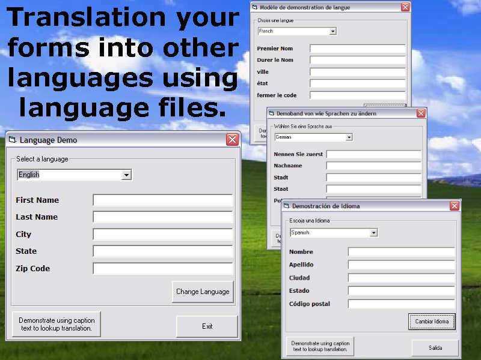



## Make your applications International  \(All Languages\)

### Description

I needed a way to make a major project I am working on work with many languages and allow users to create there own language files, this is the result of those efforts.

A class and a demonstration to allow your application to use language files. Allows you to create language.lng files for any language and change all text within the application to the new language.

The class allows you to translate text via Index, Key or Phrase.

4 Languages included in this demo, English, Spanish, German and French. There is a ReadMe.rtf file that explains how to create additional languages.

01/30/07: Version 1.0.0
 
### More Info
 

             |
---                |---
**Submitted On**   |2007-01-30 21:04:26
**By**             |[Master\_Coder](https://github.com/Planet-Source-Code/PSCIndex/blob/master/ByAuthor/master-coder.md)
**Level**          |Intermediate
**User Rating**    |4.8 (24 globes from 5 users)
**Compatibility**  |VB 6\.0
**Category**       |[Miscellaneous](https://github.com/Planet-Source-Code/PSCIndex/blob/master/ByCategory/miscellaneous__1-1.md)
**World**          |[Visual Basic](https://github.com/Planet-Source-Code/PSCIndex/blob/master/ByWorld/visual-basic.md)
**Archive File**   |[Make\_your\_2045511302007\.zip](https://github.com/Planet-Source-Code/master-coder-make-your-applications-international-all-languages__1-67762/archive/master.zip)

